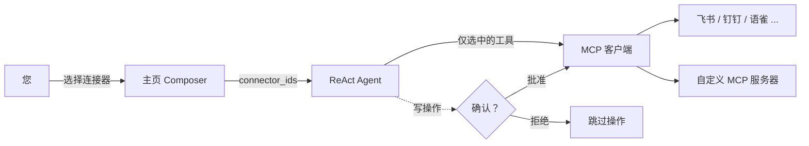

# MCP 连接器

**MCP 连接器**让您的 DB-GPT Agent 突破数据库的边界——发送消息、读写文档、管理 Issue、搜索网页——通过 **模型上下文协议（MCP）** 连接外部服务。

激活一个内置模板，或接入任意自定义 MCP 服务器，然后在 Composer 中勾选您要用的连接器。Agent 只会看到您选中的工具，任何写操作都会先暂停等待您确认。

:::info 什么是 MCP？
[模型上下文协议](https://modelcontextprotocol.io) 是一个开放标准，为 AI 应用提供统一的方式与外部工具和服务通信。DB-GPT 中的每个连接器背后都有一个 MCP 服务器支持，因此添加新功能只需指向其端点即可。
:::

## 功能亮点

- **内置模板** — 一键激活飞书、钉钉、语雀、GitHub、Notion、Linear、Tavily 和 DeepWiki。
- **自定义 MCP 服务器** — 接入任意 SSE 或 Streamable HTTP MCP 端点，自带鉴权。
- **按对话选择** — 在 Composer 中选择要挂载的连接器；Agent 的提示保持聚焦且节省 token。
- **人工确认** — 写操作（创建/更新/删除）执行前弹出确认对话框。
- **工具透明** — 可查看任意连接器的完整工具列表，包含参数和描述。
- **凭据安全** — Token 加密存储，进程重启后自动恢复。

## 工作原理

连接器有三种状态：

| 状态 | 含义 |
| --- | --- |
| **可用** | 目录中的模板，或通用的"自定义 MCP"条目——尚未配置。 |
| **已激活** | 已配置凭据并连接；工具可随时使用。 |
| **已挂载** | 在当前对话中被选中——Agent 实际注入了其工具。 |

## 内置连接器

| 连接器 | 分类 | 默认传输 | 典型工具 |
| --- | --- | --- | --- |
| 飞书 | 通信 | SSE | 发送消息、读写文档、日历 |
| 钉钉 | 通信 | SSE | 群消息、机器人通知 |
| 语雀 | 文档 | SSE | 读写知识库文档 |
| GitHub | 项目 | Streamable HTTP | Issue、PR、仓库管理 |
| Notion | 文档 | Streamable HTTP | 页面和数据库读写 |
| Linear | 项目 | Streamable HTTP | Issue/项目协作 |
| Tavily | 搜索 | Streamable HTTP | 为 LLM 优化的网络搜索，返回 Markdown |
| DeepWiki | 开发工具 | Streamable HTTP | 对任意 GitHub 仓库的 AI 阅读与问答 |

## 管理连接器

打开**连接器**页面，每个模板和自定义服务器都以卡片形式呈现。每张卡片显示图标、名称、`模板`/`自定义`徽章、分类、`MCP/SSE`（或 Streamable HTTP）传输协议以及简短描述。使用搜索框和**全部/已激活/未激活/需关注**标签进行筛选。

  

- **模板卡片**显示`激活`按钮——点击后填写凭据并连接。
- **已激活卡片**显示`● 已激活`徽章，以及测试连接、编辑或删除的快捷操作。

### 添加连接器

点击**添加连接器**打开对话框：

  

| 字段 | 描述 |
| --- | --- |
| **连接器名称** | 此连接器的显示名称。 |
| **连接器类型** | 选择内置模板或**自定义 MCP 服务器**。 |
| **传输协议** | **Streamable HTTP**（默认）或 **SSE**。 |
| **认证方式** | `none`、`bearer` 或 `token`——根据需要显示 token/header 字段。 |
| **连接器描述** | 可选。显示在 Agent 的工具描述中。 |

对于自定义服务器，只需提供端点 URL、传输协议和认证信息。凭据在存储前会加密。

### 查看工具

打开连接器的详情页面可浏览其暴露的每个工具。面板列出每个工具名称及其描述，以及**输入参数**表格（名称、类型、是否必填、描述）——有助于了解 Agent 究竟能调用什么。

  

## 在对话中使用连接器

1. 在主页上，打开 Composer 工具栏中的连接器选择器（**选择 MCP**）。
2. 勾选一个或多个连接器。Composer 显示已选数量，Agent 只会拿到这些连接器的工具。
3. 提出您的问题。当 Agent 需要某个工具时，会自动调用。
4. 如果 Agent 触发**写操作**（例如创建文档或发送消息），会弹出确认对话框。批准则执行，拒绝则跳过——Agent 都会继续。

:::tip 为什么选择很重要
只挂载所需的连接器可以让 Agent 的提示保持聚焦，减少 token 使用量，并防止模型选错工具。
:::

## 说明与限制

- 内置模板自带合理的 `confirm` 操作（写操作需要确认）；自定义 MCP 工具在本版本中运行时不需确认。
- 凭据按用户隔离，进程重启后自动恢复。
- 如果某个服务器在启动时离线，其连接器会被标记，您可以从卡片重新测试。
