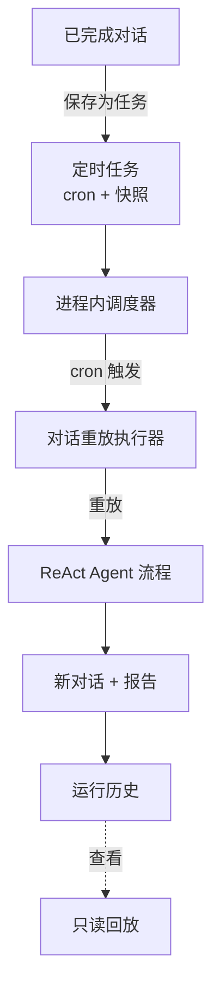

# 定时任务

**定时任务**将一次性对话转变为周期性任务。运行一次数据分析，保存为任务，DB-GPT 就会按照 cron 调度重复执行整个 ReAct Agent 流程——每次都生成一份全新的报告。

每次运行都会产生一个全新的对话，您可以稍后回放，因此始终拥有完整的生成历史和对应时间。

:::info 内置，零配置
调度器运行在 Web 服务器进程内部，自动启动。无需部署额外服务。
:::

## 功能亮点

- **保存任何对话** — 将已完成的对话（问题 + 模型 + 所选技能/连接器）冻结为可重复执行的任务。
- **灵活调度** — 选择预设（每小时/每天/每周/每月）或编写自定义 cron 表达式，并实时预览"下次运行"时间。
- **自动重放** — 每次 cron 触发时，Agent 重新运行完整流程并将结果写入历史。
- **执行历史** — 每次运行都记录状态、耗时和结果摘要。
- **无需重跑即可回放** — 打开任意历史运行记录查看其对话快照——纯读取，零 LLM 调用。
- **重启自愈** — 已启用的任务在进程重启时自动重新加载到调度器中。

## 工作原理

## 将对话保存为任务

对话生成报告后，从主页打开**保存为定时任务**。

  

| 字段 | 描述 |
| --- | --- |
| **任务名称** | 必填。任务的名称。 |
| **描述** | 可选。关于任务用途的说明。 |
| **执行频率** | `每小时` / `每天` / `每周` / `每月`，或选择 `自定义` 使用原始 cron 表达式。 |
| **Cron 表达式** | 随频率调整实时显示（例如 `0 9 * * *`）。 |

**"将复用此对话环境（只读）"** 部分显示了冻结的上下文——每次运行将重放的模型和原始问题。点击**保存并启用**即可创建任务并调度它。

## 管理任务

**定时任务**页面列出每个任务的状态、cron 表达式、下次运行时间和创建者。使用搜索框和**全部/已启用/已暂停**标签筛选，使用**启用**开关暂停或恢复任务。

  

| 列 | 描述 |
| --- | --- |
| **任务名称** | 名称和描述。 |
| **状态** | `已启用` 或 `已暂停`。 |
| **Cron 表达式** | 当前的调度计划。 |
| **下次运行** | 任务下次触发的时间。 |
| **创建者** | 任务的创建人。 |
| **启用** | 开关，用于暂停/恢复。 |
| **操作** | 编辑或删除。 |

## 任务详情与执行历史

打开任务可查看其完整配置和运行历史。

  

- **基本信息** — 状态、cron 表达式、下次运行、创建者、创建时间。
- **任务环境（只读）** — 每次运行重放的原始问题、模型和数据库。
- **执行历史** — 最近几次运行，每条记录包含状态（`成功`/`失败`/`超时`/`运行中`）、开始时间、耗时和结果摘要。

点击任意运行记录的**查看**，跳转到主页**回放该次运行的对话**——完整的步骤流和报告从历史中还原，无需 LLM 调用。顶部横幅提示该对话由定时任务生成，并附有返回任务详情的链接。

## 运行机制

1. 进程内调度器为每个已启用的任务维护一个作业，由其 cron 表达式驱动。
2. 作业触发时，执行器启动一个**新对话**，将保存的请求重放给 Agent。
3. 运行结果被记录，包括状态、摘要和用于回放的新对话 ID。
4. 各次运行相互独立——失败仅记录在该次运行中，任务只需等待下一次触发。

:::tip 回放是只读的
"查看"从数据库加载过去运行记录的已存储对话。它从不重新执行 Agent，因此是即时且免费的。
:::

## 说明与限制

- 任务失败后不重试——失败或超时的运行被记录，任务等待下一个调度时间。
- 每次运行有硬性执行超时限制，防止 Agent 失控。
- 在本版本中，任务在用户之间共享（显示创建者以便审计）；按用户隔离和通知功能计划在后续版本中提供。
