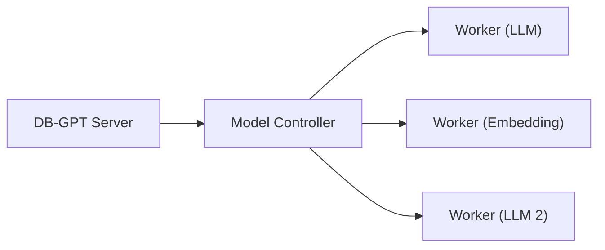

# SMMF（面向服务的多模型管理框架）

SMMF 是 DB-GPT 的模型管理层。它提供了一个统一接口来管理、切换和部署多个 LLM 和嵌入模型——无论是 API 代理还是本地托管模型。

## 为什么选择 SMMF？

不同的任务受益于不同的模型。SMMF 允许您：

- **同时运行多个模型**（例如，一个用于聊天，一个用于嵌入）
- **切换模型**无需修改代码——只需更新配置
- **独立扩展**——在集群模式下将模型部署到不同的机器上
- **混合使用提供者**——使用 OpenAI 进行聊天，使用本地模型进行嵌入

## 支持的提供者

### API 代理

| 提供者 | 配置前缀 | 示例模型 |
|---|---|---|
| **OpenAI** | `proxy/openai` | GPT-4o, GPT-4o-mini |
| **DeepSeek** | `proxy/deepseek` | DeepSeek-V3, DeepSeek-R1 |
| **Qwen (Tongyi)** | `proxy/tongyi` | Qwen-Max, Qwen-Plus |
| **SiliconFlow** | `proxy/siliconflow` | 多种托管模型 |
| **Ollama** | `proxy/ollama` | 任何 Ollama 提供的模型 |
| **Azure OpenAI** | `proxy/openai` | Azure 托管的 OpenAI 模型 |

### 本地推理

| 提供者 | 配置前缀 | 要求 |
|---|---|---|
| **HuggingFace** | `hf` | 推荐 GPU |
| **vLLM** | `vllm` | NVIDIA GPU + CUDA |
| **llama.cpp** | `llama.cpp` | CPU 或 GPU |
| **MLX** | `mlx` | Apple Silicon Mac |

## 配置

模型在 `configs/` 下的 TOML 文件中配置：

```toml
[models]

# LLM 配置
[[models.llms]]
name = "chatgpt_proxyllm"
provider = "proxy/openai"
api_key = "sk-..."

# 嵌入模型配置
[[models.embeddings]]
name = "text-embedding-3-small"
provider = "proxy/openai"
api_key = "sk-..."
```

您可以在同一个配置文件中定义多个 LLM 和嵌入模型。

## 部署模式

### 单机模式

所有模型与 DB-GPT 服务器运行在同一个进程中。简单且适合开发或单机部署。

```bash
uv run dbgpt start webserver --config configs/dbgpt-proxy-openai.toml
```

### 集群模式

模型运行在独立的工作节点上，由控制器管理。适用于具有多个 GPU 或机器的生产部署。



了解更多：[集群部署](/docs/installation/model_service/cluster)

## 下一步

- [模型提供者](/docs/getting-started/providers/) — 每个提供者的详细设置
- [SMMF 模块](/docs/modules/smmf) — 深入了解多模型管理
- [集群部署](/docs/installation/model_service/cluster) — 使用多个工作节点进行扩展
